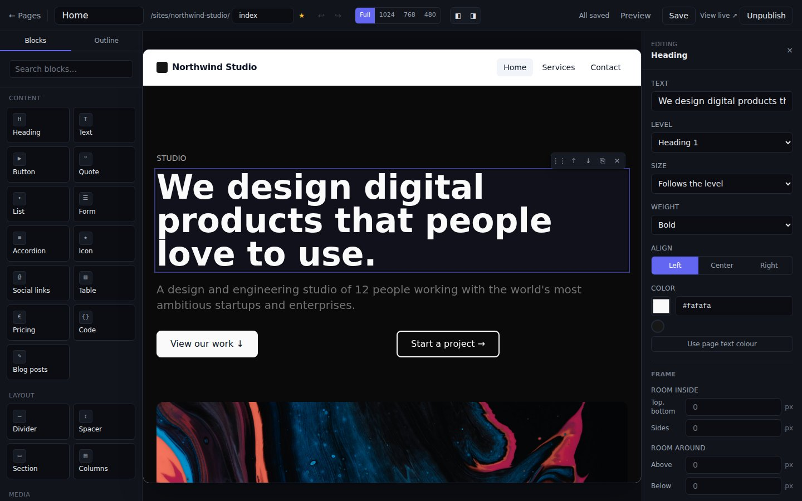
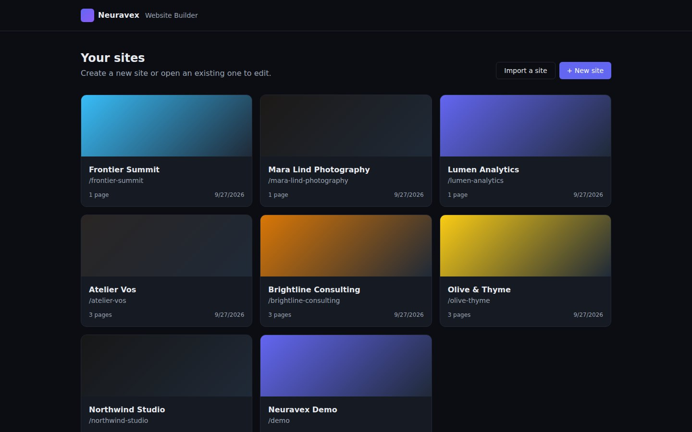
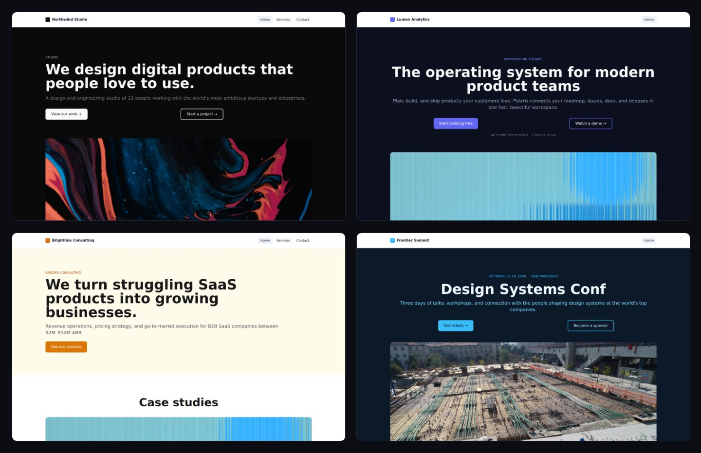

<h1 align="center">Neuravex</h1>

<p align="center">
  <strong>A visual website builder that runs on your own computer.</strong><br>
  Design pages by dragging blocks, edit text where it stands, and take the finished site away as plain HTML.<br>
  No account, no hosting, no subscription, and nothing phoning home.
</p>

<p align="center">
  <a href="https://github.com/Alpha-Flows/Neuravex/actions/workflows/ci.yml"></a>
  <a href="LICENSE"></a>
  
</p>

<p align="center">
  
</p>

## Why Neuravex

- **It is yours.** Neuravex is a program you download and run. Your sites live in one
  SQLite file on your disk, not in somebody's cloud, and keep working whether or not this
  project does.
- **The output is ordinary files.** *Download files* gives you a folder of HTML, CSS, fonts
  and images that opens with a double-click and runs on any web host — GitHub Pages,
  Netlify, S3, a shared server. There is no build step and no JavaScript in it.
- **Private by default.** No analytics, no tracking, no fonts or pictures fetched from third
  parties. The Video block plays YouTube and Vimeo through their privacy-preserving players.
- **Built for real sites.** Multi-page sites, a blog with a feed, forms, several languages,
  redirects, page history, SEO and structured data, and a check before publishing that
  finds broken links and missing picture descriptions.

> **Status:** early — version 0.1. It is used and tested on Linux and macOS; Windows should
> work but has not yet been tried by the maintainers. Expect rough edges, and please
> [report them](https://github.com/Alpha-Flows/Neuravex/issues).

## Quick start

You need [Node.js](https://nodejs.org) **22.12 or newer** and [Git](https://git-scm.com).

```bash
git clone https://github.com/Alpha-Flows/Neuravex.git
cd Neuravex
npm ci
npm run desktop
```

Your browser opens at **http://localhost:3939**. The first start sets everything up — a
`.env`, the database, a demo site — and builds the app, which takes a minute or two; later
starts are quick. Press `Ctrl+C` in the terminal to stop it.

Prefer a fixed version to the latest code? Download the archive from
[Releases](https://github.com/Alpha-Flows/Neuravex/releases), check it against
`SHA256SUMS`, unpack it, and run `npm ci` and `npm run desktop` in that folder.

A few variations:

```bash
npm run desktop 4000             # another port
npm run desktop -- --no-browser  # start the server without opening a browser
./start-desktop.sh               # macOS / Linux, from a terminal
start-desktop.bat                # Windows, double-click
```

To update a clone: `git pull`, `npm ci`, `npm run desktop` — the launcher notices the new
code, rebuilds and updates the database on its way up. **Before updating, run
`npm run backup`**: your sites are in `prisma/dev.db` and your pictures in `data/uploads/`,
and the backup takes both.

[`INSTALL.md`](INSTALL.md) covers everything else: Docker, running it as a service,
reaching it from another machine safely, and troubleshooting.

## A look around

<p align="center">
  
</p>

Start from one of **28 templates** — landing pages, portfolios, a restaurant, a law firm, a
conference, a résumé, a blog and more, 11 of them multi-page — or from a blank page.
A few of them, published:

<p align="center">
  
</p>

## Features

**Editing**
- Drag blocks from the palette, drop them into sections and columns, and edit text right on the page
- 24 block types: heading, text, image, button, video, quote, list, divider, spacer, section, columns, form, gallery, slider, audio, map, accordion, icon, social links, table, pricing, code, blog posts and custom HTML
- An inspector for every property, and a frame for any block — padding, margin, border, rounded corners, shadow and fill
- Text formatting: bold, italic, underline, strikethrough, colour, highlight and links
- Several blocks at once (Shift- or ⌘/Ctrl-click), keyboard reordering (Alt+↑/↓), undo and redo, and a preview at desktop, tablet and phone widths
- Autosave, and `⌘/Ctrl+S` for a save you want to find again

**Design**
- A site palette of up to six colours offered in every colour field, heading and body sizes set once for the whole site, and two-colour gradients
- Sixteen open-licence fonts bundled — Inter, Roboto, Montserrat, Playfair Display, Lora, JetBrains Mono and more — plus font files of your own, all served locally
- A header with your logo and a menu you arrange by hand, with dropdowns; a footer built from columns of links, contact details and profiles
- Scroll-in animations in CSS alone, which stand still for anyone who asks for less motion
- 74 bundled photographs from Unsplash, searchable, and uploads that are resized and converted to WebP in the browser, with smaller copies for phones and a focal point you choose

**Sites and pages**
- Multi-page sites with links chosen from a list; renaming a page moves every link to it and leaves a redirect behind
- A blog: posts with a date, author, summary, cover and tags, a list block and an Atom feed
- More than one language: linked translations, a language switcher and `hreflang`
- Synced blocks that stay the same on every page, saved blocks, and your own templates from any site or page
- Find and replace across every page, the menu, the footer and the settings
- A designed 404 page, and whole-site duplication

**Publishing**
- *Download files*: plain HTML and CSS with only the styles the pages use, plus a sitemap, a feed and forwarding pages for old addresses
- A check before publishing: pictures with no description, links to drafts or to nothing, headings that skip a level, oversized images
- SEO per page and per site, social images, canonical addresses, and structured data for your business and your FAQs
- Forms with every common field type and spam protection; answers are stored in the builder and can be exported as CSV, and a downloaded form can send to a form service of your choice

**Keeping your work**
- Page history with named versions, a block-by-block comparison, and restores you can undo
- A trash for deleted sites and pages, a confirmation before anything is deleted for good, and a warning when two editors — or you and an AI agent — change the same page
- Backups of a site as one zip, pictures included, that import again on this computer or another

**For AI agents** — an [MCP](https://modelcontextprotocol.io) server lets Claude, Cursor and other
MCP clients build, edit and publish sites. It can do anything you can, with no approval step, so
read [what an agent can do](INSTALL.md#what-an-agent-can-do-here) before connecting one.

**German legal pages** *(beta)* — a guided flow writes an Impressum (§ 5 DDG) and a
Datenschutzerklärung (Art. 13 DSGVO) from your details, describing what your site actually
loads, and links both from every page. The texts are German, target German law, have not yet
been reviewed by a lawyer, and are not legal advice: read them before you publish.

## Privacy and security

Neuravex makes no network requests of its own and puts no analytics in the sites you build;
it also switches off the telemetry of the Next.js and Prisma tooling it runs.

**There is no sign-in, on purpose.** Neuravex listens on `127.0.0.1` only, so the one browser
that can reach it is yours. Anyone who can reach the port can change or delete every site, so
do not open it to a network without an authenticating reverse proxy in front —
[`INSTALL.md`](INSTALL.md#reaching-neuravex-over-a-network) has a worked example.

Content is treated as untrusted even though its authors are not: HTML, CSS and SVG are parsed
and sanitised, links and picture sources are checked on every save, and every page carries a
Content Security Policy with a per-request nonce. [`SECURITY.md`](SECURITY.md) states the threat
model and how to report a problem privately; [`docs/SECURITY_REVIEW.md`](docs/SECURITY_REVIEW.md)
is a full review of the code, with every finding and its fix.

## Limitations

- **One person, one machine.** There are no user accounts, roles or audit trail.
- **Built for desktop browsers.** The editor is tested in Chrome and Chromium; the sites you
  make are responsive, the editor itself is not meant for phones.
- **You host the site.** Neuravex does not put sites online and has no custom domains; the
  download is what you publish. A form in a downloaded site needs a form service to send to.
- **Downloaded sites carry no JavaScript,** so the gallery and slider work through links: each
  picture opened or slide shown is an entry in the browser's history.
- **Maps are placed by link or coordinates.** With no network calls of its own, Neuravex cannot
  look an address up.
- **The legal pages are German only** and are a beta, as above.

## Documentation

| | |
| --- | --- |
| [`INSTALL.md`](INSTALL.md) | Installing, updating, Docker, running as a service, reverse proxies, MCP, troubleshooting |
| [`CONTRIBUTING.md`](CONTRIBUTING.md) | Setting up a development copy, the checks a change must pass, adding a block type |
| [`CLAUDE.md`](CLAUDE.md) | The architecture: how pages are stored, the two route groups, the security layers, what will catch you out |
| [`SECURITY.md`](SECURITY.md) | The threat model and how to report a vulnerability |
| [`CHANGELOG.md`](CHANGELOG.md) | What changed in each release |
| [`RELEASING.md`](RELEASING.md) | How a release is cut |
| [`docs/SECURITY_REVIEW.md`](docs/SECURITY_REVIEW.md) | The security review and every finding in it |
| [`docs/LAUNCH_CHECKLIST.md`](docs/LAUNCH_CHECKLIST.md) | What is done and what is still open, with the evidence for each |

## How it is built

| | |
| --- | --- |
| Framework | [Next.js 16](https://nextjs.org) (App Router), [React 19](https://react.dev), TypeScript |
| Styling | [Tailwind CSS](https://tailwindcss.com) |
| Data | SQLite through [Prisma](https://www.prisma.io) — one file, nothing to install |
| Editor | [dnd-kit](https://dndkit.com) for drag and drop, [zod](https://zod.dev) for validating every saved page |
| Safety | [sanitize-html](https://github.com/apostrophecms/sanitize-html) and [PostCSS](https://postcss.org) for untrusted HTML and CSS |
| AI agents | The [Model Context Protocol SDK](https://github.com/modelcontextprotocol/typescript-sdk) |
| Tests | [Vitest](https://vitest.dev) for units, [Playwright](https://playwright.dev) for the browser |

```
electron/server.js        the desktop launcher (plain Node, no Electron needed)
mcp-server.ts             the MCP server for AI agents
prisma/                   the database schema and the demo site
scripts/                  first-run setup, build, backup, release and test tooling
src/proxy.ts              host allowlist, origin check and CSP on every request
src/app/(builder)/        the builder: dashboard, site admin, page editor
src/app/(published)/      published sites, feeds, sitemaps and robots.txt
src/app/api/              the JSON API the builder talks to
src/components/           blocks, the editor, admin panels and shared UI
src/lib/                  the block tree, templates, export, sanitising, legal texts and more
e2e/                      the Playwright browser suite
public/fonts, public/stock  bundled fonts and photographs, each with its licence
```

A page is a tree of blocks stored as JSON, and every write — the editor, the API, imports,
pastes and the MCP server — goes through one validator, `src/lib/block-tree.ts`, that repairs
what it can and makes links and markup safe. [`CLAUDE.md`](CLAUDE.md) explains the rest.

## Development

```bash
npm ci
npm run setup      # .env, database and demo site
npm run dev        # http://localhost:3000, with hot reloading
npm run check      # lint, types, unit tests, advisories, build and browser tests
```

See [`CONTRIBUTING.md`](CONTRIBUTING.md) for the full set of commands and the conventions a
change is expected to follow.

## Contributing

Bug reports, fixes, documentation and new blocks are welcome. Please read
[`CONTRIBUTING.md`](CONTRIBUTING.md) first, and open an issue to discuss anything large before
writing it. Security problems go through [`SECURITY.md`](SECURITY.md), not public issues.

## Licence

Neuravex is licensed under the [Apache License 2.0](LICENSE).

The bundled fonts in `public/fonts/` are under the SIL Open Font License 1.1, and the
photographs in `public/stock/` under the [Unsplash License](https://unsplash.com/license), with
each photographer credited in `public/stock/manifest.json`. See [`NOTICE`](NOTICE).
